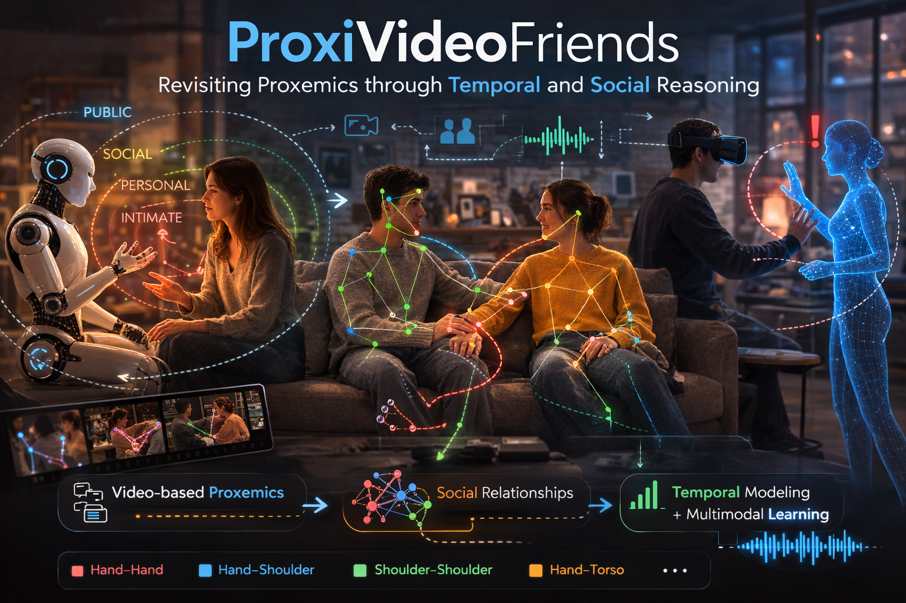
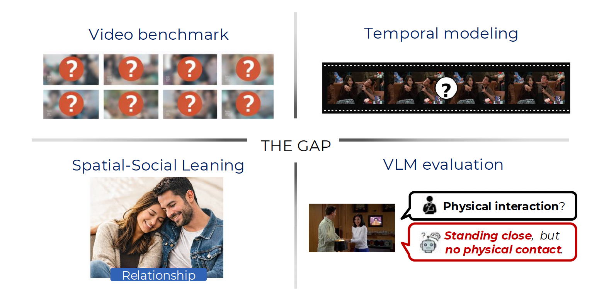
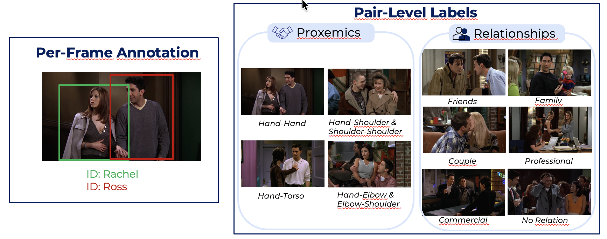
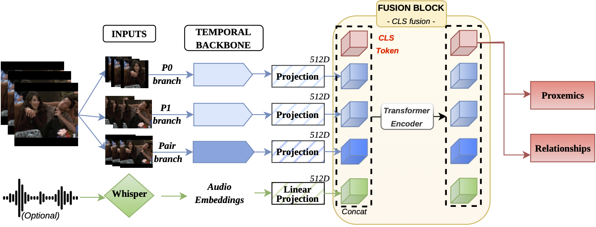
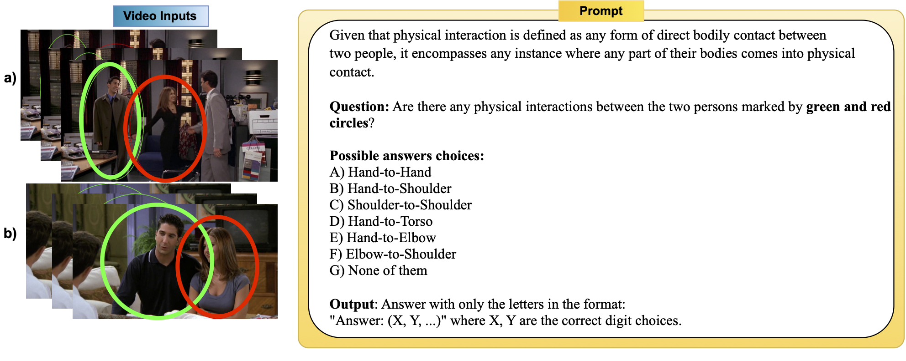
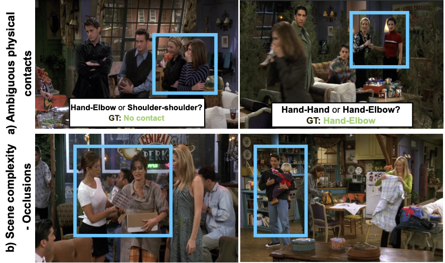

<h1 align="center">ProxiVideoFriends: Revisiting Proxemics through Temporal and Social Reasoning</h1>

<p align="center">
Developed by <b>Isabel Jiménez-Velasco</b>, <b>Rafael Muñoz-Salinas</b>,
<b>Vicky Kalogeiton</b>, and <b>Manuel J. Marín-Jiménez</b>
</p>

<p align="center">
  <a href="https://www.researchgate.net/publication/401588701_ProxiVideoFriends_Revisiting_Proxemics_through_Temporal_and_Social_Reasoning"></a>
  <a href="#dataset"></a>
</p>

Official repository for **ProxiVideoFriends**, the first benchmark for **video-based proxemics classification**, and for our **temporal multitask model** that jointly predicts **proxemics** and **social relationships**.

<p align="center">
  
</p>

---

## 🌍 Overview

Understanding **how close is too close** is essential for socially aware AI systems such as **social robots**, **virtual avatars**, and **embodied agents in VR/AR**. Proxemics, the study of how humans use space and physical contact in social interactions, is a fundamental component of non-verbal communication.

Yet, despite recent progress in video understanding and multimodal reasoning, **proxemics in video remains largely unexplored**.

In this project, we introduce:

- **ProxiVideoFriends**, the **first dataset explicitly designed for proxemics estimation in video**
- a **temporal multitask model** that jointly predicts **proxemics** and **social relationships**
- a systematic comparison against both **image-based baselines** and a modern **Video-Language Model (Qwen3-VL-30B)**

Our findings show that:

- **temporal modeling matters**
- **joint spatial-social learning gives the biggest boost**
- **audio helps relationship recognition, but not proxemics**
- **modern VLMs still struggle with fine-grained physical contact understanding**

---

## 🤖 Why this matters


A socially intelligent system should not only detect people and actions, but also understand **how people relate in space**.

Without reliable proxemics estimation:

- a robot may invade personal space
- a virtual avatar may behave inappropriately
- a simulation may fail to reproduce realistic human interaction

Proxemics is not just geometry. It also carries **social meaning**.


---
## ❗ What is missing in prior work



Despite its importance, proxemics research still suffers from four major limitations:

1. **No dedicated video benchmark** for proxemics  
2. Most methods are still **frame-based**  
3. Proxemics is often modeled **without social context**  
4. Modern VLMs have not been systematically evaluated on this fine-grained task  

This repository addresses that gap.

---

## ✨ Contributions

- We introduce **ProxiVideoFriends**, the **first video benchmark for proxemics**, jointly annotated for **physical contact** and **social relationships**.
- We propose a **temporal multitask architecture** that jointly learns proxemics and relationship recognition from video.
- We benchmark against:
  - **ProxemicsNet++** as a frame-based baseline
  - **Qwen3-VL-30B** in both **zero-shot** and **fine-tuned** settings
- We show that:
  - **temporal modeling is essential**
  - **social relationships improve proxemics recognition**
  - **audio is useful for relationships but not for proxemics**

---

## 🎬 Dataset: ProxiVideoFriends

Most proxemics datasets operate on **static images**, which cannot capture the **temporal evolution of human interactions**.  
To address this limitation, we introduce **ProxiVideoFriends**, built from **Season 3 of _Friends_** to study proxemics in **dynamic, realistic social scenes**.

<p align="center">
  
</p>

**Annotations per frame.** Bounding boxes, character identities, pair-level **proxemics labels**, and pair-level **social relationship labels**.

- **Proxemics.** Hand-Hand, Hand-Shoulder, Shoulder-Shoulder, Hand-Torso, Hand-Elbow, Elbow-Shoulder.  
- **Relationships.** Friends, Family, Couple, Professional, Commercial, No Relation.

| Frames | Pairs | Avg. clip length | FPS | Episode split | Overlap |
|---:|---:|---:|---:|---:|---:|
| 42,117 | 103,284 | 4.7 s | 24 | 13 train / 12 test | None |

---

## 🧠 Method

We propose a **temporal multitask model** for joint **proxemics** and **social relationship** recognition from video.

For each target pair, the model processes three visual inputs: the crop of **person 0**, the crop of **person 1**, and a **joint crop** containing both individuals. The two person branches share weights, while the pair branch remains independent to preserve interaction context.

Each stream is encoded with a pretrained temporal video backbone, such as **ResNet(2+1)D** or **mViTv2**. The resulting embeddings are then fused using either **Cross-Attention (CA)** or **CLS-token Transformer fusion**.

The model jointly predicts **proxemics** as a **multi-label** task and **social relationship** as a **multi-class** task, optimized with **binary cross-entropy** and **cross-entropy**, respectively.

We also explore an optional multimodal extension using **Whisper audio embeddings** to evaluate whether audio further improves performance.

<p align="center">
  
</p>

---

## 🧪 Baselines

We compare our method against two complementary baselines.

### 1. Frame-based baseline
We use **ProxemicsNet++**, a state-of-the-art method for proxemics classification in still images, applied **frame by frame**.

### 2. Video-Language Model baseline



We evaluate **Qwen3-VL-30B** as a prompt-based video baseline.

For each video sequence:

- the target pair is highlighted with colored circles
- the model receives a structured proxemics prompt
- we test both:
  - **zero-shot**
  - **fine-tuned**


---

## 📊 Results

### 🏆 Proxemics classification on ProxiVideoFriends

| Method | mAP |
|---|---:|
| ProxemicsNet++ | 17.9 |
| Qwen3-VL-30B | 28.1 |
| Qwen3-VL-30B Fine-Tuned | 30.6 |
| mViTv2 (our temporal)| 30.2 |
| ResNet(2+1)D (our temporal) | 32.5 |
| 🏆 **Ours Temporal + Multitask Model** | **40.1** |

*Best result in bold.*

These results show that:
- video models clearly outperform frame-based approaches
- multitask learning provides the strongest improvement
- our method improves over the fine-tuned VLM by **9.5 mAP**

### 🤝 Effect of multitask learning

| Training Setup | Proxemics mAP | Relationship Acc | Relationship Macro-F1 |
|---|---:|---:|---:|
| Proxemics Only | 32.5 | - | - |
| Relationship Only | - | 39.5 | 17.0 |
| **Multitask (CLS Fusion)** | **40.1** | **45.9** | **20.1** |

*Best results in bold.*

Joint learning improves both tasks, confirming that **proxemics and social relationships are complementary**.

### 🔊 Effect of audio

| Model | Proxemics mAP | Relationship Acc | Relationship Macro-F1 |
|---|---:|---:|---:|
| **Multitask (Visual Only)** | **40.1** | 45.9 | 20.1 |
| Multitask + Audio | 37.6 | **46.2** | **25.0** |

*Best result for each metric in bold.*

Audio improves **relationship classification**, but not **proxemics**.

This suggests that:
- proxemics is primarily **visual**
- relationships benefit from **speech cues**, such as tone and prosody

---

## 🎭 Qualitative results



Our model performs well on many realistic, dynamic interactions, but proxemics remains challenging.

Typical failure modes include:

- **ambiguous physical contact**, such as confusing Hand-Hand with Hand-Elbow
- **occlusions and scene complexity**
- difficult camera angles
- overlapping people in crowded scenes


---

## 📁 Repository structure

The code is available in this repository. The dataset will be released soon as a downloadable ZIP file, and we recommend placing it at the same directory level as the repository. Similarly, the output directory used to store trained models should also be created at that same level.

```text
workspace/
├── ProxiVideoFriends/          # source code repository
│   ├── assets/
│   ├── dataset_utils/
│   ├── demo/                   # demo script and best multitask model chkp
│   ├── evaluation/
│   ├── qwen3_VL/               # code for testing QwenVL3 on ProxiVideoFriends
│   ├── scripts/
│   ├── train/
│   ├── .gitignore
│   ├── README.md
│   ├── environment.yml
│   └── requirements.txt
├── ProxiVideoFriends.zip       # dataset archive (to be released soon)
├── dataset/                    # extracted dataset directory
└── output_models/              # saved checkpoints, logs, and results
```


---

## 📦 Dataset

The **ProxiVideoFriends** dataset will be available for download soon.

It will be distributed as a **ZIP file** containing all the data required for training and evaluation. Once downloaded, extract it at the same directory level as this repository.

> **Important:** when training, use the path to the **extracted dataset folder**, not the ZIP file.

------------------------------------------------------------------------

## ⚙️ Installation

Clone the repository:

```bash
git clone <YOUR_REPO_URL>
cd ProxiVideoFriends
```

You can install the dependencies using either **Conda** or **pip**.

### Option 1: Conda

```bash
conda env create -f environment.yml
conda activate proxivideofriends
```

### Option 2: pip

```bash
python3 -m venv .venv
source .venv/bin/activate
pip install -r requirements.txt
```

------------------------------------------------------------------------

## 🚀 Pretrained Model

We provide the best checkpoint of 🏆 **ours Temporal + Multitask Model**  in the `demo/` folder for quick inference and reproducibility.

- **Model directory:** `demo/best_model_multitask/`
- **Best checkpoint:** `demo/best_model_multitask/model_best.pt`
- **Saved configuration:** `demo/best_model_multitask/config.json`

This pretrained model corresponds to the best multitask checkpoint obtained during training and can be directly used with the demo script below.

------------------------------------------------------------------------


## 🎥 Demo

We include a simple demo script to run inference on a short video using the pretrained multitask model and obtain proxemics and relationship predictions.

To try the demo, go to the `demo/` directory and run:

```bash
cd demo/
python3 run_demo.py \
  --videoPath video_demo/video1.mp4 \
  --model_dir best_model_multitask/ \
  --outputDir ../../demo_output
```
### Output
The demo script performs the following steps:

- Extracts video frames at 24 fps
- Detects the two people involved using [**YOLO11**](https://github.com/ultralytics/ultralytics) to obtain person bounding boxes
- Generates clippings from the detected bounding boxes
- Loads the pretrained multitask model
- Runs inference for proxemics and relationship recognition
- Saves the predictions to a JSON file

The main outputs are:

- `demo_output/frames_24fps/`
- `demo_output/clippings/`
- `demo_output/demo_prediction.json`

The JSON file contains the predicted proxemics labels and the relationship class for the input video.


## 🏋️ Training

To train a model, go to the `scripts/` directory and run:

```bash
cd scripts
python3 run_train.py \
  --datasetDIR <path_to_dataset> \
  --outModelsDIR <path_to_output_models> \
  [--task {proxemics,relationship,multitask}] \
  [--backbone {ResNet18,mViTv2}] \
  [--fusion {crossAttention,CLS}] \
  [--audio] \
  [--onlyPairRGB]
```

> Additional hyperparameters such as batch size, learning rate, number of epochs, window size, stride, optimizer, or frozen layers can also be configured through command-line arguments in `run_train.py`.

- The `--datasetDIR` argument must point to the dataset root directory.
- The `--outModelsDIR` argument must point to the directory where experiment outputs will be stored.
- Trained models are organized automatically inside the output directory according to the selected configuration.

------------------------------------------------------------------------

## 🧪 Testing

To evaluate a trained model, go to the `scripts/` directory and run:

```bash
cd scripts
python3 run_test.py \
  --model_dir <path_to_trained_model_dir> \
  [--checkpoint_name {model_best.pt,model_last.pt}] \
  [--device cuda]
```
------------------------------------------------------------------------
------------------------------------------------------------------------

## 🧩 QwenVL3

The `qwen3_VL/` directory contains the code to evaluate **Qwen3-VL-30B** on **ProxiVideoFriends**.

To run the Qwen3-VL baseline, move to the `qwen3_VL/` directory, create the environment, and install the dependencies:

```bash
cd qwen3_VL
conda env create -f environment.yml
conda activate qwenVL3
```
Then run:

```bash
python3 run_test_QwenVL3.py \
  --datasetDIR ../../dataset/ \
  --resultDIR ../../ \
  [--set {1/2}] 
```

### Output
The demo script performs the following steps:
- Loads the test split of ProxiVideoFriends
- Uses the preprocessed frame sequences provided with the dataset, where the target pair is already marked with colored circles
- Builds video clips, runs Qwen3-VL-30B inference, and computes AP / mAP
- Saves cached responses and final evaluation results as JSON files


------------------------------------------------------------------------

## 📌 Citation

If you use this repository, dataset, or method in your research, please cite:

``` bibtex
@inproceedings{JimenezVelasco2026ProxiVideoFriends,
  author    = {Jim{\'e}nez-Velasco, I. and Mu{\~n}oz-Salinas, R. and Kalogeiton, V. and Mar{\'i}n-Jim{\'e}nez, M. J.},
  title     = {ProxiVideoFriends: Revisiting Proxemics through Temporal and Social Reasoning},
  booktitle = {Proceedings of the 21st International Conference on Computer Vision Theory and Applications (VISAPP)},
  volume    = {1},
  pages     = {107--116},
  year      = {2026},
  publisher = {SciTePress},
  organization = {INSTICC},
  doi       = {10.5220/0014345000004084},
  isbn      = {978-989-758-804-4},
  issn      = {2184-4321}
}
```

------------------------------------------------------------------------

## 🙏 Acknowledgments

This research was supported by:

**Project PID2023-147296NB-I00**\
Spanish Ministry of Science, Innovation and Universities.

------------------------------------------------------------------------

